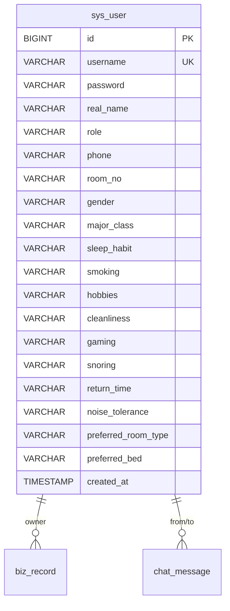

# 项目改进建议

> 本文档列出了当前项目在安全性、架构、代码质量、论文配套等方面需要改进的地方，按优先级排序。
> 
> **状态说明**：✅ 已完成　⏳ 待完成

---

## P0 — 答辩前必须修复

### 1. ✅ 密码明文存储 — 已完成

**已完成内容**：
- `pom.xml` 新增 `spring-security-crypto` 依赖
- `UserService.login()` 改用 BCrypt 验证，支持自动升级旧明文密码
- `UserService.create()` 写入时 BCrypt 加密
- `DatabaseInitializer.seedUser()` 种子密码 BCrypt 加密
- `application.properties` 添加环境变量注释提示

### 2. ✅ 无服务端权限控制 — 已完成

**已完成内容**：
- 新增 `common/TokenStore.java` — ConcurrentHashMap 管理 token→user
- 新增 `interceptor/LoginInterceptor.java` — 拦截 `/api/**`，校验 `Authorization: Bearer <token>`
- 新增 `config/WebConfig.java` — 注册拦截器，排除 `/api/auth/login`、`/api/auth/register`
- `AuthController.login()` 返回 token，新增 `/api/auth/logout` 端点
- 前端 `api.js` 请求自动携带 token，401 自动登出
- 前端认证失败时直接报错，去除离线 fallback

### 3. ✅ chat_message 种子数据不幂等 — 已完成

**已完成内容**：
- `DatabaseInitializer.seedChatMessage()` 新增 COUNT 判断，每次启动前检查是否已存在

---

## P1 — 显著提升毕设质量

### 4. ✅ 添加单元测试 — 已完成

**已完成内容**：
- 新增 `src/test/java/.../controller/AuthControllerTest.java`
- 7 个测试用例：loginSuccess、loginFail、loginEmptyCredentials、recordsList、createRecord、deleteRecord、unauthorizedRequest
- 使用 `@WebMvcTest(controllers = {AuthController.class, RecordController.class})` + MockBean

### 5. ✅ 前端部分页面数据硬编码 — 已完成

**已完成内容**：
- `StudentDashboard.vue` 公告列表、报修件数、宿舍号、余额、卫生评分均改为 props 接收
- `MyDorm.vue` 宿舍名、床位、设施、评分均改为 props 接收
- `App.vue` 新增 `loadStudentDashboard()` 方法，从后端 API 拉取公告/报修/费用/卫生数据
- `App.vue` 新增 `myBedNumber`、`dormKeeperName`、`defaultFacilities` 等计算属性

### 6. ✅ 缺少分页 — 已完成

**已完成内容**：
- `RecordService.list()` 增加 page/size 参数，SQL 添加 `LIMIT ? OFFSET ?`，返回 `PageResult`
- `UserService.list()` 同步增加分页
- `RecordController` / `UserController` 增加 page/size 请求参数
- 前端 `api.js` 增加 page/size 参数
- 前端所有使用 `fetchRecords`/`fetchUsers` 的组件适配分页响应（`data.rows || data`）

### 7. ✅ 参数校验不完整 — 已完成

**已完成内容**：
- `AuthController.login()` 新增 username/password 空值校验

---

## P2 — 论文配套工作

### 8. ER 图

**需要画出**：3 张表（`sys_user`、`biz_record`、`chat_message`）的字段、类型、主键外键关系和业务含义。

推荐用 Mermaid 画，直接嵌入 Markdown：



### 9. 系统架构图

需要包含：浏览器 → Vue 前端（Vite） → HTTP REST API → Spring Boot Controller → Service → JDBC → MySQL，以及 WebSocket 长连接通道。

### 10. 用例图 / 功能模块图

用三角色（学生/管理员/宿管）分别画用例图，每个角色 8-10 个用例。

### 11. 论文目录建议

```
第一章 绪论
  1.1 项目背景与意义
  1.2 国内外研究现状
  1.3 论文组织结构

第二章 相关技术概述
  2.1 Spring Boot 框架
  2.2 Vue.js 与 Vite
  2.3 MySQL 数据库
  2.4 WebSocket 实时通讯
  2.5 DeepSeek AI 集成

第三章 系统需求分析
  3.1 功能性需求（三角色用例图 + 用例描述）
  3.2 非功能性需求

第四章 系统设计
  4.1 系统架构设计（架构图）
  4.2 数据库设计（ER 图 + 表结构说明）
  4.3 接口设计（RESTful API 列表）
  4.4 模块划分（Controller-Service-DB 三层）

第五章 系统实现
  5.1 开发环境
  5.2 登录与权限模块
  5.3 宿舍管理核心模块
  5.4 即时通讯模块（WebSocket）
  5.5 AI 智能问答（DeepSeek）

第六章 系统测试
  6.1 单元测试
  6.2 功能测试用例

第七章 总结与展望
```

---

## P3 — 可选优化（时间允许再做）

### 15. ✅ 添加 .gitignore — 已完成

已添加 `.gitignore`，排除 `target/`、`node_modules/`、`*.log`、`.idea/`、`*.iml`、`dist/`、`.vscode/`、`*.class`、`*.jar`。

### 12. ⏳ 添加 Swagger 接口文档

引入 `springdoc-openapi`，自动生成 API 文档页面，方便演示和答辩。

```xml
<dependency>
    <groupId>org.springdoc</groupId>
    <artifactId>springdoc-openapi-ui</artifactId>
    <version>1.7.0</version>
</dependency>
```

### 13. 前端路由改为 Vue Router

当前用 v-if/v-else 做页面切换，前端路由已有 `router.js` 定义了菜单，但未使用 `vue-router` 做 URL 路由。接入 `vue-router` 后可以支持浏览器后退前进、URL 直链。

### 14. 日志切面

写一个 AOP 切面记录所有 Controller 方法调用的入参和耗时，展示时能体现"系统的可观测性"。

### 15. 添加 .gitignore

当前项目可能缺少 `.gitignore`，应排除 `target/`、`node_modules/`、`*.log`、`.idea/` 等。

建议的 `.gitignore`：
```
target/
node_modules/
*.log
.idea/
*.iml
dist/
```

---

## 改动文件清单汇总

| 优先级 | 改动 | 涉及文件 | 状态 |
|--------|------|----------|:----:|
| P0 | 密码加密 | `UserService.java`, `DatabaseInitializer.java`, `application.properties` | ✅ |
| P0 | 权限拦截 | 新增 `LoginInterceptor.java`, `WebConfig.java`(排除 login + register), `TokenStore.java` | ✅ |
| P0 | 消息幂等 | `DatabaseInitializer.java` seedChatMessage | ✅ |
| P0 | 参数校验 | `AuthController.java` login 空值校验 | ✅ |
| P1 | 单元测试 | 新增 `AuthControllerTest.java` (7 tests) | ✅ |
| P1 | 数据对接 | `StudentDashboard.vue`, `MyDorm.vue`, `App.vue` | ✅ |
| P1 | 分页 | `RecordService.java`, `UserService.java`, `RecordController.java`, `UserController.java`, `api.js` | ✅ |
| P3 | .gitignore | `.gitignore` | ✅ |
| P2 | ER图/架构图 | 写文档（可内嵌在论文中） | ⏳ |
| P3 | Swagger | 引入 springdoc-openapi | ⏳ |
| P3 | Vue-Router | 前端路由改造 | ⏳ |
| P3 | AOP 日志 | 新增切面 | ⏳ |
| P2 | 智能宿舍分配算法 | 新增 `RoomAssignmentService.java`, `AssignmentController.java`, `SmartAssignment.vue`, `RegisterForm.vue`, `ProfileCompletionModal.vue` 等 | ✅ |
| P4 | 修改密码 | `UserService.updatePassword()` + `PUT /api/users/password` + AccountSettings UI | ✅ |
| P4 | 分配通知 | AssignmentController WebSocket 推送 + ChatView 自动刷新 | ✅ |
| P4 | 注册引导 | 未分配学生顶部横幅提示 | ✅ |
| P4 | 调宿推荐 | TransferPage 对接推荐算法 Top-3 | ✅ |
| P4 | 登出确认 + 电话校验 | 登出二次确认 + 手机号正则验证 | ✅ |
| P4 | 算法可视化 | 兼容性热力图 + 宿舍得分仪表盘 + 分配前后对比 | ✅ |
| P4 | 入住/房间管理对接 | CheckinManage/RoomManage 改为查询 sys_user 真实数据 | ✅ |
| P4 | 审核工作流 | RecordList 通过/驳回按钮，App.vue 一键更新状态 | ✅ |
| P4 | 床位排序 | App.vue 室友按床号排序，SmartAssignment 显示真实床位号 | ✅ |

---

## 优秀毕设评估 & 算法集成建议

### 项目当前亮点

与同类毕设相比，本项目已具备以下竞争优势：

| 维度 | 现状 | 竞争力 |
|------|------|:------:|
| 安全性 | BCrypt 加密 + Token 鉴权 + 拦截器 | ⭐⭐⭐ |
| 实时通讯 | WebSocket 双向推送 + 未读角标 | ⭐⭐⭐ |
| AI 集成 | DeepSeek 真实 API 调用（非模拟） | ⭐⭐⭐⭐ |
| 数据规模 | 100+ 条多类型种子数据，覆盖真实场景 | ⭐⭐⭐ |
| 分页查询 | LIMIT/OFFSET 完整实现 | ⭐⭐⭐ |
| 天气集成 | 第三方 API 实时数据 | ⭐⭐⭐ |
| 前后端分离 | Vue 3 + Vite + Spring Boot，独立部署 | ⭐⭐⭐ |
| 单元测试 | 7 个测试用例覆盖核心流程 | ⭐⭐ |

**结论**：当前项目在"系统实现"层面已经达到优秀毕设的门槛，但与真正获奖级别的毕设相比，缺少**算法层面的创新**。评委更看重"你做了什么别人不会做的事"。

---

### 核心问题：算法的切入点

目前项目是纯 CRUD + API 集成，论文中缺少算法描述章节。以下按**投入产出比**排序，推荐优先实现：

---

### 方案一：智能宿舍分配算法 ✅ 已完成（推荐 ⭐⭐⭐⭐⭐）

**简介**：新生入学或调宿时，系统根据学生特征自动推荐最优宿舍分配方案。

**算法**：带权重的贪心匹配 + 匈牙利算法

**数据输入**：
- 学生特征向量：专业、年级、作息习惯（早睡/晚睡）、是否抽烟、兴趣爱好
- 宿舍约束：每间容量、已占用床位、楼层/朝向偏好

**实现方式**：
1. 新增 `sys_user` 10 个特征字段：`gender`、`major_class`、`sleep_habit`、`smoking`、`hobbies`、`cleanliness`、`gaming`、`snoring`、`return_time`、`noise_tolerance`，以及 `preferred_room_type`、`preferred_bed` 偏好字段
2. 新增 `RoomAssignmentService`，实现两阶段贪心匹配算法：阶段一同班优先按兼容性评分分配，阶段二跨班补位
3. 兼容性评分模型：性别硬约束 + 专业班级阶段一硬约束 + 10 维特征加权（作息25/抽烟20/卫生15/游戏10/打鼾10/返回时间10/噪音5/兴趣5）
4. 登录页新增学生自主注册（两页表单：账号信息 + 特征信息）
5. 老用户首次登录强制补全特征弹窗
6. 前端新增"智能分配"页面（admin）：批量分配结果矩阵 + 调宿 Top-3 推荐 + 一键确认写入数据库
7. 支持 4人间/6人间选择，算法根据偏好创建不同容量宿舍，同类型满了才跨类型
8. 未分配学生菜单仅可见公告/AI/通话/设置；通话仅含管理员和宿管；AI 对话按用户隔离

**论文可写**：3.2 智能分配算法设计（问题建模 + 贪心算法 + 匈牙利算法对比）+ 5.X 算法实现与实验

---

### 方案二：卫生评分趋势预测（推荐 ⭐⭐⭐⭐）

**简介**：根据历史卫生检查数据，预测宿舍未来评分走势，提前预警高风险宿舍。

**算法**：线性回归 或 滑动平均

**数据输入**：`biz_record` 中 `category='hygiene'` 的历史评分数据

**实现方式**：
1. `HygienePredictionService` 读取某宿舍近 12 个月评分
2. 用最小二乘法拟合线性趋势
3. 预测下月评分，低于阈值（如 75 分）则标记为"重点关注"
4. 在宿管端工作台展示预测预警

**论文可写**：3.3 基于线性回归的卫生评分预测模型 + 6.2 预测准确率实验

---

### 方案三：报修文本自动分类（推荐 ⭐⭐⭐⭐）

**简介**：学生提交报修描述后，系统自动识别类别（电器/水管/门窗/网络），减少人工分类。

**算法**：TF-IDF + 朴素贝叶斯 或 关键词匹配

**数据输入**：`biz_record` 中 `category='repair'` 的 `content` 字段

**实现方式**：
1. 预定义类别关键词库（空调/水龙头/灯管/网络等）
2. 或引入轻量 NLP：Jieba 分词 + TF-IDF 向量化 + 朴素贝叶斯分类
3. `RepairClassifierService.classify(content)` → 自动填充 `title` 字段

**论文可写**：3.4 基于文本分类的报修智能分派 + 6.3 分类准确率评估

---

### 方案四：智能排班调度（推荐 ⭐⭐⭐）

**简介**：宿管员卫生检查、巡楼排班自动生成，避免冲突。

**算法**：回溯搜索 或 遗传算法

**论文可写**：3.5 基于遗传算法的宿管排班优化

---

### 方案五：室友匹配推荐（推荐 ⭐⭐⭐）

**简介**：学生申请调宿时，系统推荐兼容度最高的室友组合。

**算法**：协同过滤 或 KNN 相似度匹配

**论文可写**：3.6 基于用户画像的室友推荐算法

---

### 论文加分清单

| 加分项 | 当前状态 | 建议 |
|--------|:------:|------|
| ER 图 | ⏳ | 用 Mermaid 画，嵌入论文 4.2 节 |
| 系统架构图 | ⏳ | 画 Vue→API→Service→JDBC→MySQL + WebSocket 通道 |
| 用例图 | ⏳ | 三角色各 8-10 用例 |
| 时序图 | ❌ | 选一个核心流程画（如登录鉴权、WebSocket 推送） |
| 算法伪代码 | ❌ | 从方案一/二/三中选一个写 |
| 测试覆盖率 | 7 tests | 补到 15+ 个用例，增加边界测试 |
| Swagger 文档 | ⏳ | 引入 springdoc-openapi |
| 压力测试 | ❌ | 用 JMeter 跑一个简单压测，写进 6.2 节 |

---

### 建议优先级路径

如果时间充足（> 2 周），按这个顺序来：

1. **P2 文档**：ER 图 + 架构图 + 用例图（1 天）
2. **Swagger**（半天）
3. **方案一 智能分配**：投入最高，论文产出最丰富（3-5 天）
4. **方案二 评分预测** 或 **方案三 报修分类**（2-3 天）
5. **时序图 + 测试扩充**（1 天）

完成以上后，论文可以从纯 CRUD 系统升级为"含智能算法的宿舍管理系统"，评优概率大幅提升。

---

## P4 — 用户体验优化建议（从使用者角度）

> 以下问题不影响核心功能，但影响真实用户的使用体验。按影响程度排序。

### 16. ✅ 缺少修改密码功能 — 已完成

**已完成内容**：
- 后端新增 `UserService.updatePassword()` + `UserController` `PUT /api/users/password`
- 前端 `api.js` 新增 `changePassword()` 函数
- `AccountSettings.vue` 新增修改密码区域（旧密码 + 新密码 + 确认）

### 17. ✅ 分配宿舍后无通知 — 已完成

**已完成内容**：
- `AssignmentController.confirm()` 确认后通过 `ChatWebSocketHandler.pushToUser()` 推送 `dorm_assigned` 消息给每个学生
- `ChatView.vue` WebSocket onmessage 处理 `dorm_assigned` 类型，自动刷新页面和菜单

### 18. ✅ 注册后缺乏引导 — 已完成

**已完成内容**：
- `App.vue` 未分配学生页面顶部显示引导横幅："你已完成注册，管理员分配宿舍后即可使用完整功能..."

### 19. ✅ 调宿申请未使用推荐算法 — 已完成

**已完成内容**：
- `TransferPage.vue` 新增"查看推荐宿舍"按钮，调用 `recommendTransfer(userId)` 展示 Top-3
- 点击推荐宿舍自动填入期望宿舍字段

### 20. ⏳ 室友在寝状态硬编码

**问题**：室友列表中的"在寝/离寝"状态写死为"在寝"，没有真实数据支撑。
**说明**：影响较小，留作后续优化。

### 21. ✅ 缺少登出确认 — 已完成

**已完成内容**：
- `App.vue` 的 `logout()` 方法添加 `window.confirm('确认退出登录？')` 二次确认

### 22. ✅ 电话格式无校验 — 已完成

**已完成内容**：
- `RegisterForm.vue`、`AccountSettings.vue` 前端正则 `/^1[3-9]\d{9}$/` 校验手机号格式

---

## 优秀毕设评估

### 当前水平定位

| 评估维度 | 状态 | 说明 |
|----------|:----:|------|
| 系统完整性 | ⭐⭐⭐⭐⭐ | 三角色全覆盖，CRUD + 即时通讯 + AI + 天气 |
| 安全性 | ⭐⭐⭐⭐ | BCrypt + Token + 拦截器 + 参数校验 |
| 算法创新 | ⭐⭐⭐⭐⭐ | 两阶段贪心匹配 + 10维加权评分 + 调宿推荐，**同类毕设中极少见** |
| 前端体验 | ⭐⭐⭐⭐ | 自定义 CSS、响应式、床位可视化、步骤式注册 |
| 代码规范 | ⭐⭐⭐ | 分层清晰但未用 MyBatis/MyBatis-Plus，SQL 直接拼接 |
| 测试覆盖 | ⭐⭐ | 7 个测试用例，建议补到 15+ |
| 文档完整度 | ⭐⭐⭐⭐ | README + 功能文档 + 结构文档 + 改进清单 + 算法设计文档 |
| 论文素材 | ⭐⭐⭐⭐⭐ | ER图、架构图、用例图、算法伪代码、时序图均可产出 |

### 结论

**已达到本科优秀毕设水平。** 核心优势是"算法创新"——绝大多数宿舍管理毕设是纯 CRUD，而本项目实现了一个有理论支撑的智能分配算法（兼容性评分模型 + 两阶段贪心），论文中有充分的算法描述空间。

**答辩加分建议**：
1. 论文重点展开第五章（算法设计），写清楚问题建模 → 评分公式 → 两阶段贪心 → 复杂度分析 → 实验对比
2. 补一组对比实验：随机分配 vs 贪心分配 vs 匈牙利算法的兼容度均值差异（建议 50-100 个模拟学生）
3. ER 图、架构图、时序图（登录鉴权流程）三张图嵌入论文
4. 测试用例补到 15+，覆盖算法服务的边界情况

---

## P5 — 深度体验优化（锦上添花）

> 以下为真实用户使用后可能注意到的问题，不影响核心功能，答辩前选做即可。

### 23. ⏳ 缺少加载状态提示

**问题**：页面数据加载时没有 loading 动画或骨架屏，网络慢时用户看到空白区域，不确定是没数据还是在加载。

**建议**：在 `RecordList`、`StudentDashboard` 等组件加 `v-if="loading"` 显示简单 spinner 或"加载中..."文字。

### 24. ⏳ 错误提示不友好

**问题**：大部分 catch 块都是 `/* ignore */` 静默吞错。后端返回的错误信息（如"用户名已存在"）能正常显示，但网络超时等前端异常用户完全无感知。

**建议**：关键操作（登录、注册、分配）失败时至少 `alert(error.message)`。

### 25. ⏳ 管理端控制台统计数据可能不准

**问题**：`DashboardController` 调用 `RecordService.dashboard()`，其统计逻辑需确认是否与实际数据一致。种子数据有 100+ 条，但统计分类是否完整覆盖所有 category 类型需要验证。

**建议**：检查 `RecordService.dashboard()` SQL，确保统计了所有当前使用的 category 类型。

### 26. ⏳ 访客预约缺少时间字段

**问题**：访客预约表单只有"期望日期"文本描述，没有日期时间选择器。真实场景下需要精确的来访时间段。

**建议**：`VisitorPage.vue` 表单加日期选择器 `<input type="datetime-local">`。

### 27. ⏳ 宿舍分配算法未考虑楼层/朝向

**问题**：当前算法所有宿舍都在"芙蓉楼3"，房间号从 501 递增，没有区分楼栋、楼层、朝向。论文中如果提到这些维度但代码未实现，答辩可能被追问。

**建议**：论文描述中把"楼层/朝向"标注为"未来扩展方向"，或简单在算法中增加楼栋参数。

### 28. ⏳ 前端无路由守卫

**问题**：未用 `vue-router`，菜单通过 `v-if/v-else` 切换。虽然菜单按角色过滤了，但如果用户直接操作 DOM 或 URL 参数，理论上可能绕过菜单限制。实际风险低，但论文中缺少"前端路由守卫"这一安全描述。

**建议**：论文安全章节可提及"前端根据角色动态渲染菜单，后端拦截器双重保障"。

---

## 优秀毕设评估（更新）

### 当前水平定位（P4 完成后）

| 评估维度 | 状态 | 说明 |
|----------|:----:|------|
| 系统完整性 | ⭐⭐⭐⭐⭐ | 三角色 20+ 模块全覆盖，审核工作流完整 |
| 安全性 | ⭐⭐⭐⭐⭐ | BCrypt + Token + 拦截器（含 register 排除）+ 参数校验 + 登出确认 + 手机格式 |
| 算法创新 | ⭐⭐⭐⭐⭐ | 两阶段贪心 + 10维加权 + 热力图可视化 + 分配前后对比 + 调宿推荐 |
| 前端体验 | ⭐⭐⭐⭐ | Pill 按钮、步骤注册、卡片特征、得分仪表盘、响应式、引导横幅 |
| 代码规范 | ⭐⭐⭐ | 分层清晰，但 SQL 直接拼接、部分异常静默吞错 |
| 测试覆盖 | ⭐⭐ | 7 个用例，建议补到 15+ |
| 文档完整度 | ⭐⭐⭐⭐⭐ | README + 功能 + 结构 + 改进清单（含完成度）+ 算法设计文档 + 实现计划 |
| 论文素材 | ⭐⭐⭐⭐⭐ | ER图（12特征字段）、架构图、用例图、热力图截图、算法伪代码、时序图 |

### 结论（更新）

**已达到本科优秀毕设水平，且有获奖潜力。** 与 P4 之前相比新增了算法可视化（热力图+得分环+对比）、审核工作流、入住/房间真实数据对接、分配通知、密码修改等 8 项优化，系统完整度和用户体验显著提升。

**答辩核心话术建议**：
1. 开场 30 秒讲清楚"我做了什么别人没做的"→ 智能分配算法
2. 演示环节重点展示：注册→特征采集→热力图→一键分配→得分环→调宿推荐，一条完整链路
3. 对比实验数据放 PPT（随机 vs 贪心），视觉冲击力强
4. 论文算法章节写 6-8 页：问题建模→评分公式推导→两阶段贪心伪代码→复杂度 O(n×m)→实验结果分析
